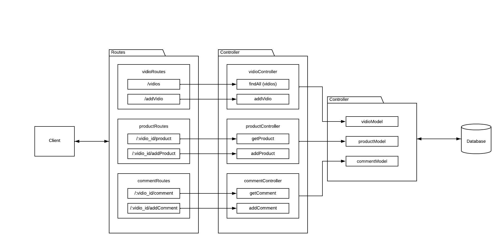

# Mid Term Project (Backend)
This project is submitted for the mid-term project of Full Stack Engineering on GIGIH 3.0 Program.
# Database Structure and Schema
- Vidio

```json
{
	"_id": "string",
	"imgURL": "string"
}
```

- Product

```json
{
    "_id": "string",
    "video_id": "string",
    "product_id": "string",
    "url": "string",
    "title": "string",
    "price": "string"
}
```

- Comment

```json
{
    "_id": "string",
    "video_id": "string",
    "username": "string",
    "comment": "string",
    "time": "date"
}
```
# API Structure

# List API Request and Response
## Vidios
- Vidio object
```
{
  imgURL: string
}
```
### GET /vidios
Returns all vidio in the system.
- **URL Params**  
  http://localhost:3000/vidios
- **Data Params**  
  None
- **Headers**  
  Content-Type: application/json  
- **Success Response:**  
**Code:** 200  
**Content:**  
```
[
    {
        "_id": "string",
        "imgURL": "string",
    },
    ...
]
```
- **Error Response:**  
**Code:** 500  
**Content:**
```
{
    "message": "error.message"
}
```
### POST /addVidio
Add a new vidio and return it into new object.
- **URL Params**  
  http://localhost:3000/addVidio
- **Headers**  
  Content-Type: application/json  
- **Data Params**  
```
{
  "imgURL": "string"
}
```
- **Success Response:**  
**Code:** 200  
**Content:**
```
{
    "message": "Vidio was added",
    "saved": {
        "_id": "string",
        "imgURL": "string"        
    }
}
```
- **Error Response:**  
**Code:** 500  
**Content:**
```
{
    "message": "error.message"
}
```
---
## Product
- Product object
```
{
    "vidio_id": "string",
    "product_id": "string",
    "url": "string",
    "title": "string",
    "price": "string"
}
```
### GET /:vidio_id/product
Returns all product in the system.
- **URL Params**  
  http://localhost:3000/(vidio_id)/product
- **Data Params**  
  None
- **Headers**  
  Content-Type: application/json  
- **Success Response:**  
**Code:** 200  
**Content:**  
```
[
    {
        "_id": "string",
        "vidio_id": "string",
        "product_id": "string",
        "url": "string",
        "title": "string",
        "price": "string"
    },
    ...
]
```
- **Error Response:**  
**Code:** 500  
**Content:**
```
{
    "message": "error.message"
}
```
### POST /:vidio_id/addProduct
Add a new product and return it into new object.
- **URL Params**  
  http://localhost:3000/(vidio_id)/addProduct
- **Headers**  
  Content-Type: application/json  
- **Data Params**  
```
{
    "product_id": "string",
    "url": "string",
    "title": "string",
    "price": "string"
}
```
- **Success Response:**  
**Code:** 200  
**Content:**
```
{
    "message": "Product was added",
    "saved": {
        "_id": "string",
        "vidio_id": "string",
        "product_id": "string",
        "url": "string",
        "title": "string",
        "price": "string",
    }
}
```
- **Error Response:**  
**Code:** 500  
**Content:**
```
{
    "message": "error.message"
}
```
---
## Comment
- Comment object
```
{
    "video_id": "string",
    "username": "string",
    "comment": "string",
    "date": "Date"
}
```
### GET /:vidio_id/comment
Returns all comments in the vidio
- **URL Params**  
  http://localhost:3000/(vidio_id)/comment
- **Data Params**  
  None
- **Headers**  
  Content-Type: application/json  
- **Success Response:**  
**Code:** 200  
**Content:**  
```
[
    {
        "_id": "string",
        "video_id": "string",
        "username": "string",
        "comment": "string",
        "date": "string",
    },
    ...
]
```
- **Error Response:**  
**Code:** 500  
**Content:**
```
{
    "message": "error.message"
}
```
### POST /:vidio_id/addComment
Add a new comment and return it into new object.
- **URL Params**  
  http://localhost:3000/(vidio_id)/addComment
- **Headers**  
  Content-Type: application/json  
- **Data Params**  
```
{
    "product_id": "string",
    "username": "string",
    "comment": "string",
    "date": "string"
}
```
- **Success Response:**  
**Code:** 200  
**Content:**
```
{
    "message": "Comment was added",
    "saved": {
        "_id": "string",
        "vidio_id": "string",
        "username": "string",
        "comment": "string",
        "date": "string"
    }
}
```
- **Error Response:**  
**Code:** 500  
**Content:**
```
{
    "message": "error.message"
}
```
# Documenter Postman
https://documenter.getpostman.com/view/18804867/2s9XxsWH2s
# How to run in local
Clone this repository
```
https://github.com/verydianT/mid-Term-Project.git
```
Install the packages
```
npm install
```
Open `.env.example` file in the folder, then change into `.env` and set it into your database connection.   
Run the program using
```
npm start
```

